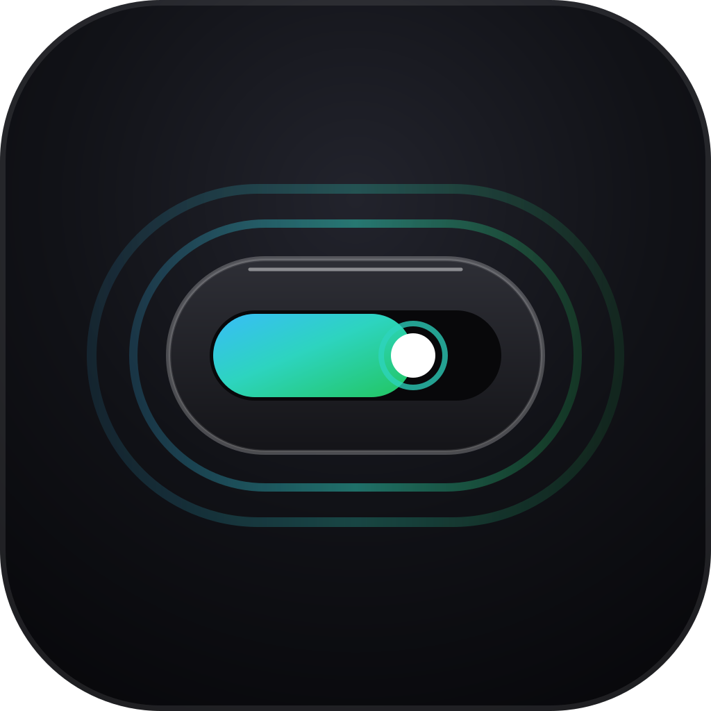

<div align="center">



# atoll · 环礁

**钉在 Windows 屏幕顶部的灵动岛悬浮组件**

智谱 GLM Coding Plan 滚动用量监控 · 极简番茄钟 · 多模块扩展容器

[](https://github.com/yak33/atoll/releases)
[](https://github.com/yak33/atoll/releases)
[](https://tauri.app/)
[](https://vuejs.org/)
[](LICENSE)

[🌐 访问官网](https://atoll-site-swart.vercel.app/) &nbsp;|&nbsp; [⬇️ 下载最新版 (v0.2.5)](https://github.com/yak33/atoll/releases/latest) &nbsp;|&nbsp; [📝 版本更新说明](https://github.com/yak33/atoll/releases)

</div>

---

## 🌊 什么是 atoll？

> **环礁 (Atoll)**：海洋中由一圈珊瑚岛礁环抱中央泻湖而成的地形。  
> 在产品构想中，主程序就是这片静谧坚实的**礁盘**，每个功能则是礁盘上长出的一座**小岛**。模块越挂越多，环礁逐渐成形。

**atoll** 是一款专为 Windows 桌面打造的现代「灵动岛」悬浮组件。平时只是一颗 260 × 44 像素的极简胶囊，钉在屏幕顶部边缘：
- **额度还剩多少，瞟一眼就知道**：告别频繁切网页查额度，滚动窗口、倒计时与限额告警尽收眼底。
- **克制且不打扰**：不占任务栏、不抢焦点、全屏游戏与视频毫秒级隐身、拖到哪就停在哪。

---

## ✨ 核心特性

### 1. 智谱 GLM Coding Plan 实时监控
- **双滚动窗口**：实时上报 5 小时与 7 天两个滚动用量窗口的已用百分比与重置倒计时。
- **纯本地倒计时**：倒计时由本地应用时钟高精度演算，不产生任何无谓网络请求。
- **三档感知告警**：
  - 🟢 **正常态**（< 75%）：翡翠青绿高光游标，药丸保持默认底色；
  - 🟡 **留意态**（≥ 75%）：胶囊整体转为暖琥珀色，提示适度收着点用；
  - 🔴 **告警态**（≥ 90%）：红色柔和**内发光呼吸脉冲**（避开窗口硬裁切）；
  - 🔔 **重置提醒**：额度窗口一旦重置，自动发送 Windows Toast 通知。
- **全场景支持**：适配个人版与团队版（支持配置 `organizationId` 与 `projectId`）；兼容 Token 限额模式与信用额度模式。

### 2. 番茄钟专注模块
- **防休眠跑偏**：基于结束时间戳的精确状态机，系统睡眠唤醒自动冻结并暂停，时间绝不累加跑偏。
- **双阶段流转**：专注与休息自动切换，阶段完成桌面 Toast 提醒；番茄钟运行中微弱心跳呼吸律动。
- **随时调节**：工作时长（5~60 分钟）与休息时长自由滑杆配置，下一阶段即时生效。

### 3. 6 款调优质感皮肤与 11 种偶发流光
- **6 套质感皮肤**：黑曜石（经典翠绿）、深海蓝（科技冰蓝）、极光紫（暗夜霓虹）、赤焰橙（暖意落日）、薄荷绿（清爽森系）、钛金金（哑黑钛金），底壳色调、高光游标与设置面板全局联动。
- **11 种偶发物理流光**：边框流光、彗星拖尾、双流光、粒子对撞、波纹扩散、双波汇流、声呐涟漪、极光色散、月食金边、斜向扫光、星火微闪，让桌面充满生命力。
- **深浅自适应**：浅色、深色、跟随 Windows 系统无缝自动切换。

### 4. 极致克制的不打扰体验
- **全屏自动隐藏**：检测到前台窗口全屏（游戏、全屏看片、PPT 演示投屏）灵动岛瞬时隐身，退出全屏自动恢复。
- **系统托盘实时监控**：
  - 鼠标悬停右下角托盘图标即可看实时状态：`atoll · 5h: 24% | 7d: 45%` 或 `atoll · 🍅 专注 22:15`；
  - 托盘右键菜单支持一键显示 / 隐藏与退出。
- **自由拖拽与记忆**：按住展开面板任意位置即可拖动，窗口位置保存在本地，下次启动原位恢复。
- **丝滑交互反馈**：收起态鼠标滚轮上下滑动平滑滑屏切屏切换模块；鼠标悬停 200ms 平滑展开完整面板，离开半秒防误触收回。

---

## 🖥️ 三态形态设计

```
[ 收起态 260×44 ] ──( 悬停 / 点击 )──> [ 展开态 340×170 ] ──( 点击设置 )──> [ 设置态 340×480 ]
  5h [■■■□] 44% 2h15m                      双窗口完整数据 + 刷新按钮               API Key / 时长 / 皮肤
```

| 状态 | 尺寸 (逻辑像素) | 行为与用途 |
| :--- | :--- | :--- |
| **收起态 (Pill)** | `260 × 44` (宽度可自定义) | 常驻屏幕顶部，展示当前最紧张窗口或番茄钟状态。鼠标滚轮上下推拉切模块 |
| **展开态 (Expanded)** | `340 × 170` | 鼠标悬停 200ms 展开两档完整进度条、套餐档位、数据抓取时间及快速刷新 |
| **设置态 (Settings)** | `340 × 480` | 点击打开设置面板，配置 API Key、番茄钟时长、主题模式、质感皮肤、开机自启 |

---

## 🚀 快速开始

### 方式一：下载安装包（推荐）
1. 前往 [Releases 页面](https://github.com/yak33/atoll/releases/latest) 下载最新的 `atoll_0.2.5_x64-setup.exe`；
2. 双击安装（安装到当前用户目录，**无需管理员权限**）；
3. 打开后点击顶部药丸胶囊，在用量设置中粘贴您的智谱 API Key（如果是团队版，一并填入组织 ID 即可）。

> 🔒 **隐私声明**：atoll 是零后端的纯桌面应用，您的 API Key 仅以加密形式存储在本机本地应用数据目录中，除直连智谱官方额度接口外，绝不向任何第三方服务器上传任何数据。

---

## 🛠️ 技术架构与特性

```
atoll/
├── src/
│   ├── adapters/        # 数据源适配器: zhipu.ts(官方非公开接口解析与集中容错)
│   ├── core/            # 核心业务逻辑
│   │   ├── QuotaPoller.ts       # 轮询调度器: 5分钟轮询 + 随机抖动 + 指数退避
│   │   ├── pomodoro.ts          # 番茄钟状态机: 纯函数, 基于结束时间戳防漂移
│   │   ├── appSettings.ts       # 设置持久化: Tauri Store, 包含皮肤预设与外观配置
│   │   ├── theme.ts             # 主题与 6 款皮肤切换, 系统深浅实时响应
│   │   ├── tray.ts              # 系统托盘 Tooltip 实时状态同步
│   │   ├── windowLayout.ts      # 窗口多状态物理尺寸计算与高分屏缩放适配
│   │   └── fullscreenWatch.ts   # Rust 前台窗口探测驱动的全屏自动隐藏
│   ├── components/      # UI 组件: 药丸 (Pill) / 展开面板 (Panel) / 设置 (Settings)
│   └── App.vue          # 三态状态机、全局 CSS 变量、偶发流光系统与切屏容器
├── src-tauri/           # Rust 壳层: 窗口控制 / 系统托盘 / 全屏探测 / 开机自启
└── site/                # Vercel 静态落地页 (HTML/CSS/JS 零构建)
```

### 关键设计约定
- **解析隔离**：所有智谱接口的不确定字段由 [adapters/zhipu.ts](src/adapters/zhipu.ts) 单独封装并由单测覆盖，UI 层只接收标准统一数据模型，严禁专有字段渗入组件。
- **安全鉴权**：遵循智谱官方协议直接发送裸 API Key（不加 `Bearer` 前缀）。
- **绿色低耗**：
  - 轮询下限 3 分钟 + 随机抖动，杜绝任何滥刷行为；
  - 安装包大小仅 **~2.86 MiB**；
  - 任务管理器常驻内存仅 **~138 MB**（绝大部分为 Windows WebView2 基础底噪，Tauri 主进程仅 ~30 MB）；
  - **38 个单元测试全部自动化通过**。

---

## 💻 本地开发与构建

### 前置要求
- [Node.js](https://nodejs.org/) ≥ 20
- [Rust](https://www.rust-lang.org/) stable (已在 rustc 1.97.1 验证)
- Visual Studio 生成工具（勾选「C++ 桌面开发」工作负载）
- Windows 10 / 11（自带 WebView2 运行时）

### 开发命令

```bash
# 1. 克隆代码仓库
git clone https://github.com/yak33/atoll.git
cd atoll

# 2. 安装前端依赖
npm install

# 3. 启动开发模式 (同时启动 Vite 与 Tauri 透明置顶窗口)
npm run tauri dev

# 4. 运行全套单元测试
npm test

# 5. 前端类型检查与构建
npm run build

# 6. 打包 Windows 安装包 (产物在 src-tauri/target/release/bundle/nsis/)
npm run tauri build
```

---

## 🧩 如何为 atoll 扩展新模块？

atoll 采用容器化模块设计，增加新功能非常简单（可直接参考番茄钟模块的实现）：
1. 在 `src/core/` 中编写纯业务逻辑或状态机（纯函数，配套 `.test.ts` 单测）；
2. 在 `src/components/` 中成对编写收起态药丸 `XxxPill.vue` 与展开面板 `XxxPanel.vue`；
3. 在 `src/core/appSettings.ts` 中的 `IslandModule` 联合类型追加模块名称；
4. 在 `src/App.vue` 模板中引入并在收起态与展开态中挂载；
5. 用户即可通过滚轮滑动或 Tab 点击在各功能模块间无缝切换！

---

## 📜 开源协议

本项目采用 [MIT License](LICENSE) 开源协议。
